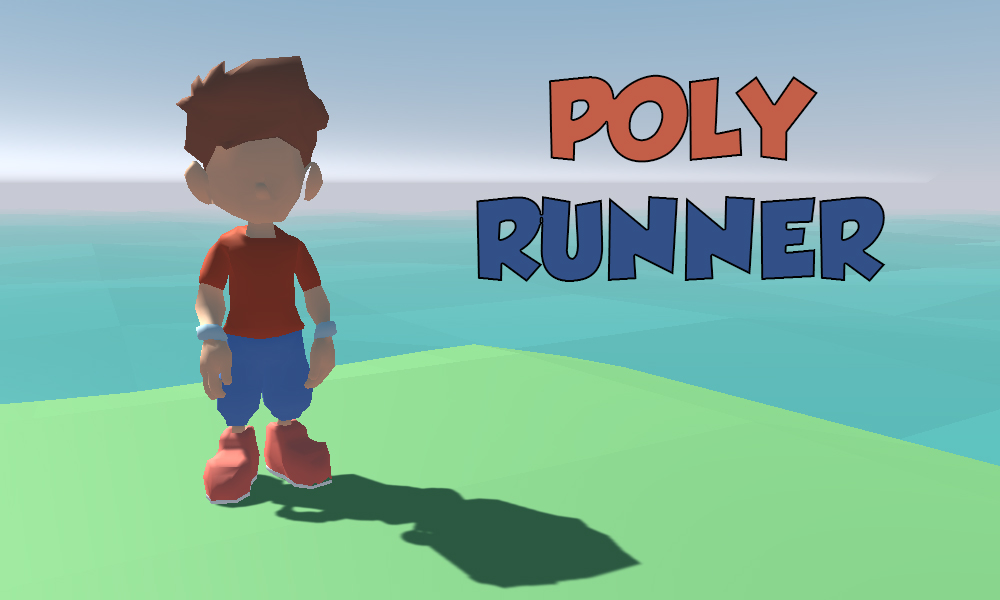
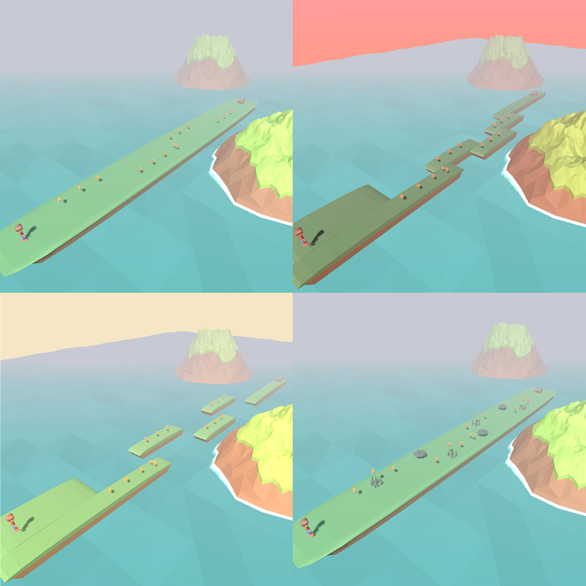

<h1 align="center"> Poly Runner </h1>  

  

  This is my Techcareer Game Development Bootcamp final project.

 

 

## Game UI

I used Sweet Land GUI package in Poly Runner. I only designed the level selection screen and the credit screen. I designed buttons to stop, restart and return to the main menu within the game.

 

  

## Tools

Technologies I use in the game. I couldn't use URP because I had to develop with free assets.

* New Input System
* Cinemachine
* Mixamo for Animation
* Low Poly Water System by <a href="https://assetstore.unity.com/packages/tools/particles-effects/lowpoly-water-107563#reviews">Ebru Dogan</a>

 

### Gameplay

 

  

  

 

## Collecting System

The main purpose of the game is to collect the gold in the game and reach the end of the level. If you reach the end of the game you earn a star. If you collect more than 10 gold, you will earn one more star. If you collect the key, the chest at the end of the game will open and you will earn one more star.

 

  

 

## Losing Mechanics

If you fall off the platform or hit obstacles, you will lose one live. You have three lives in the game. When you run out of lives, you start from level 1 again.

  

## Acknowledgments

* Character by <a href="https://opengameart.org/content/low-poly-character-blend-file">Zisongbr</a>
* Environment by <a href="https://quaternius.com/index.html">Quaternius</a>
* Low Poly Water <a href="https://assetstore.unity.com/packages/tools/particles-effects/lowpoly-water-107563#description">Ebru Dogan</a>
* Animation by <a href="https://www.mixamo.com/">Mixamo</a>
* UI by <a href="https://assetstore.unity.com/packages/2d/gui/sweet-land-gui-208285#publisher">Sweet Land GUI</a>
* Musics by <a href="https://assetstore.unity.com/packages/audio/music/casual-game-bgm-5-135943#description">B.G.M</a>
